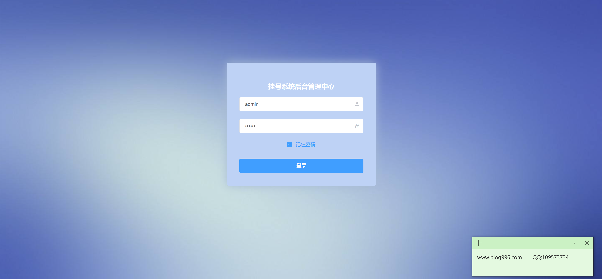
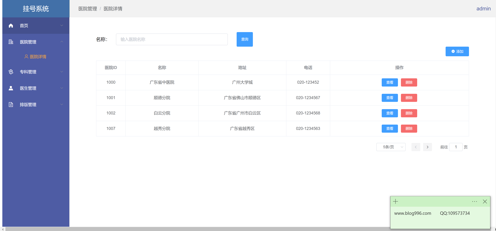
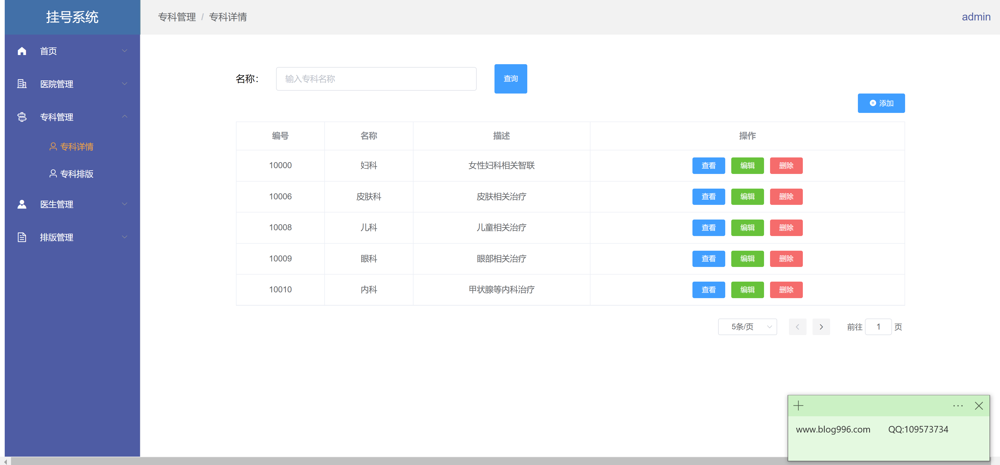
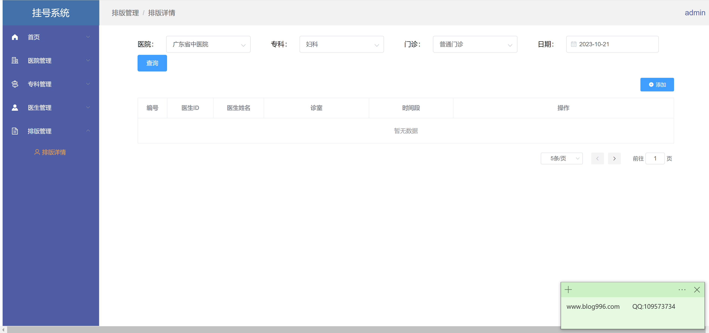
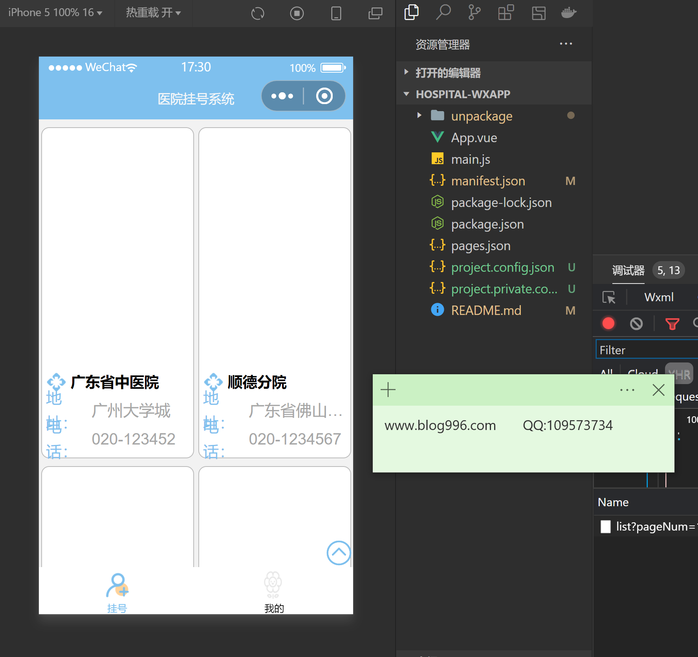
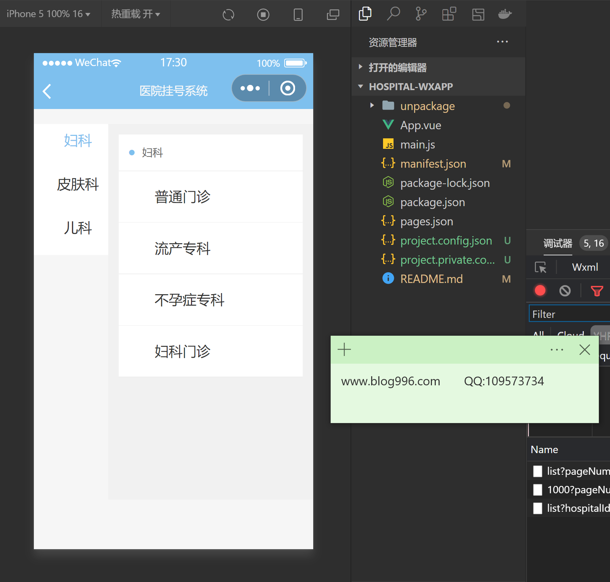
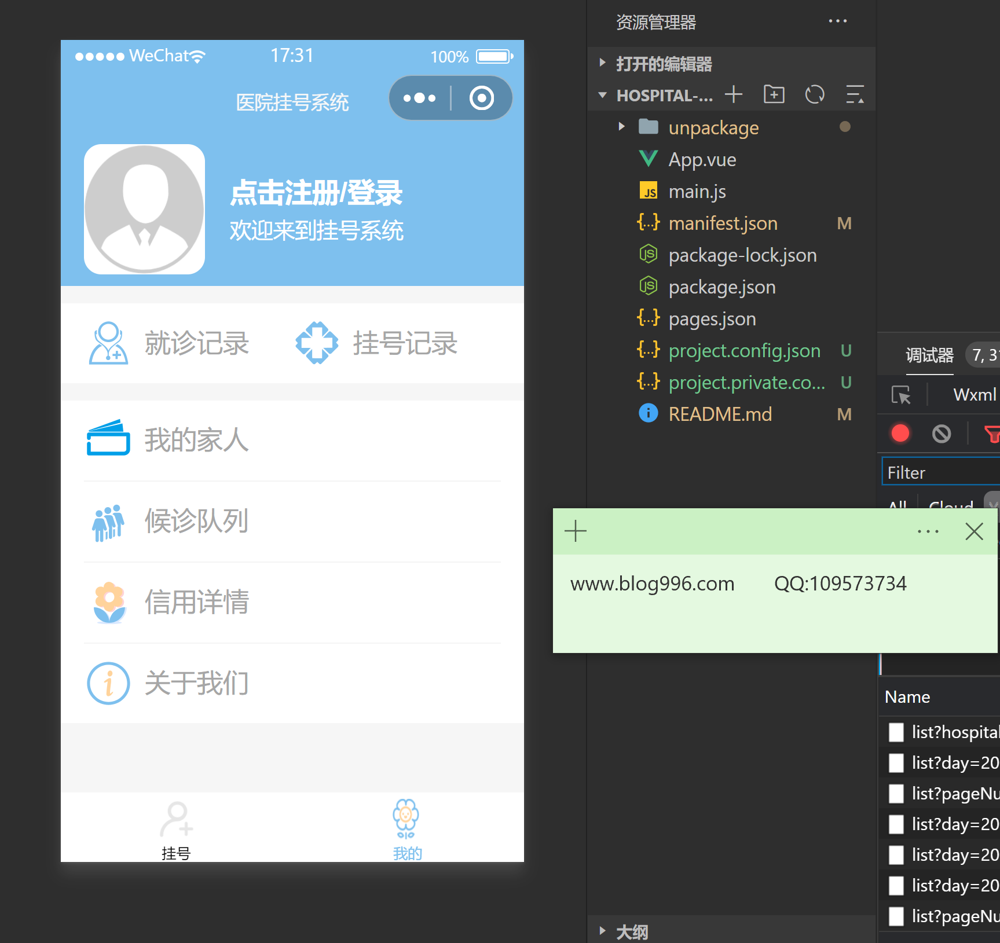

<h1 align="center">医院挂号小程序管理系统</h1>

## 简介
医院挂号小程序管理系统：提供管理员、用户角色，包含医院管理、专科管理、医生管理、排班管理等功能，支持用户操作方便、系统开发优化及调试。    --计算机毕业设计源码；毕设源码；java毕业设计源码

## 联系方式

<h3 align="center">获取完整代码与数据库文件 + 微信：bysj5151 QQ: 86050149 QQ群: 783742310</h3>

<h3 align="center">可帮忙远程部署 包运行成功！提供远程部署、修改代码、设计文档指导、代码讲解等服务！</h3>

## 功能介绍（完整见运行截图）
管理员： 登录和管理医院挂号小程序的后台系统。可以管理医院信息、专科、医生以及排班详情。提供医院的增加、删除、编辑和搜索功能，支持专科的查看、编辑与删除操作。便于通过项目文件结构对应用进行管理和调试。用户可选择日期和门诊类别进行查询，并可通过分页功能查看和管理数据。

用户： 登录或注册进入医院挂号小程序，通过移动界面管理个人的挂号、就诊记录和家庭成员信息。可选择医院科室进行挂号，查看候诊队列和信用详情。支持在APP中查看个人资料以及就诊记录，并能够在项目中根据需求扩展功能。通过应用程序中的“关于我们”获取更多信息。

## 运行截图

本代码来源于网络,仅供学习参考使用!

